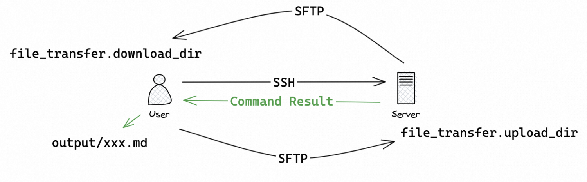
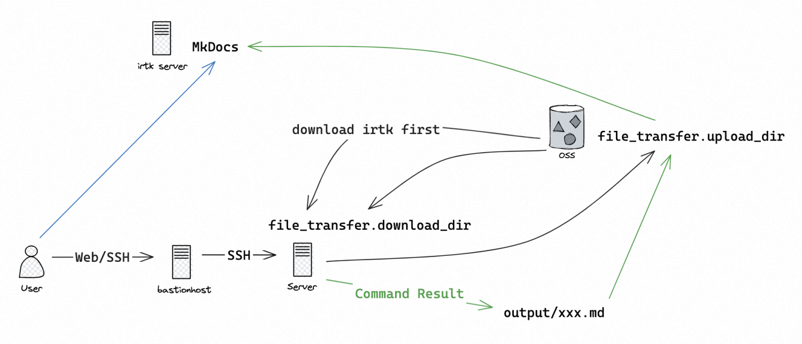
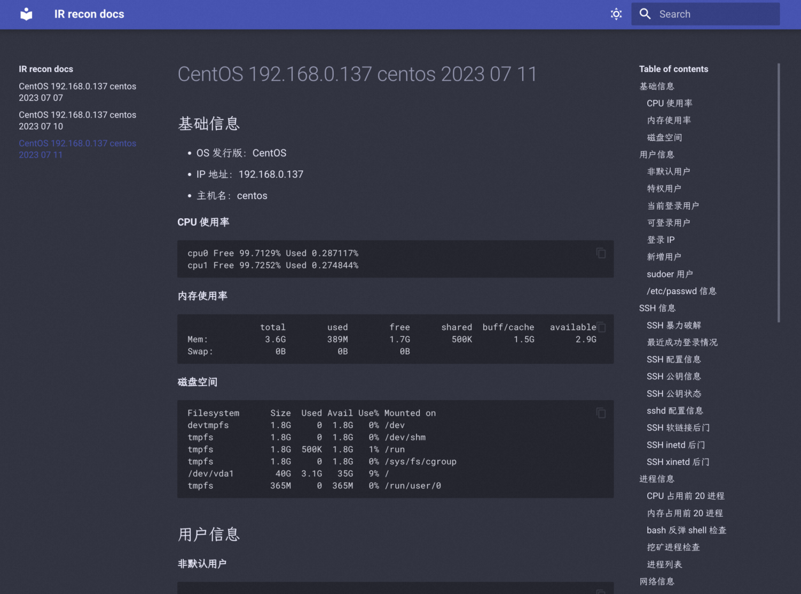

# irtk

Incident Response ToolKit for fast, comprehensive and accurate security information gathering on victim hosts. Designed for internal team use only.

## Directory structure

```
.
├── config.py         # config module
├── config.yaml       # config file
├── downloads         # store files downloaded from remote
│   └── access.log
├── main.py
├── oss.py            # OSS module
├── output            # store the output
│   └── xxx.md
├── recon             # modules for security information gathering
│   ├── basic.py
│   ├── cron.py
│   ├── env.py
│   ├── files.py
│   ├── __init__.py
│   ├── log.py
│   ├── network.py
│   ├── process.py
│   ├── recon.py
│   ├── rootkit.py
│   ├── service.py
│   ├── ssh.py
│   └── users.py
├── requirements.txt
├── server.py         # Server program integrated with Dingtalk bots
├── ti.py             # threat intelligence module
├── util.py
└── yuque.py          # Yuque module(Deprecated)
```

## Configuring irtk

Please keep the config file safe as it contains sensitive information.

```yaml
mode: remote # Run mode: local/remote

ssh_info: # SSH related config
  host: x.x.x.x # SSH host
  port: 22 # SSH port
  username: root # SSH username
  password: "xxx" # SSH password
  pkey: "/path/to/id_rsa" # SSH private key file

file_transfer: # File transfer config
  upload_dir: /tmp/irtk_upload # remote upload directory
  download_dir: ./downloads # local download directory

recon: # switches for information gathering module
  users: true
  ssh: true
  process: true
  network: true
  cron: true
  log: true
  files: true
  env: true
  service: true
  rootkit: true

process: # process information gathering config
  cpu_top: 20 # check top x high-CPU process
  mem_top: 20 # check top x high-mem process

log: # log collection config
  custom_log_path: /var/log/yum.log # customized log to collect

files: # file information gathering config
  verbose: false # whether or not to perform some time-consuming operations
  mtime: 1 # find modified files in last x days
  ctime: 1 # find changed files in last x days
  large_files_threshold: 200M # threshold for large files

ti: # threat intelligence config
  ak: xxx # API Key for VirusTotal

mkdocs: # MkDocs config
  enabled: false # whether or not to output to MkDocs(does not work in local mode)
  endpoint: http://x.x.x.x:8000 # MkDocs endpoint
  path: /root/mkdocs/docs # local MkDocs documentation directory(on the endpoint server)

oss: # OSS config
  endpoint: https://oss-cn-hongkong.aliyuncs.com # OSS endpoint
  bucket: ir-transfer-station # OSS bucket
  ak: xxx # OSS AccessKeyId
  sk: xxx # OSS AccessKey Secret
```

## Running irtk

### Remote mode

#### Run locally

Run `python3 main.py` locally to start remote mode：



Note that `mkdocs.enabled` must be `false` now.

> Running remote mode locally is about to be deprecated so that `mkdocs.enabled` will not need to be `false`.

#### ChatOps

Chat with Dingtalk bot Scout to start remote mode:


Extra features like interactive shell, file transfer, etc. are not supported in chat.

### Local mode

For victim hosts behind a bastion host, use curl/wget to download irtk from the Internet. Then set the `mode` config to be `local` and run `python3 main.py` to transfer files with OSS:



Now the outputs will be automatically uploaded to OSS. On irtk server, download the output to MkDocs documentation directory to view the result.

## Viewing the result

Use any Markdown reader/editor to view/search the result, or use the provided MkDocs site:



You can use the search bar on the top-right corner to quickly find the information needed.

## About file transfer

- Both absolute/relative path are supported for local file path
- Only absolute path is supported for remote file path
- Be careful about OSS path and file system path
- Transferring the entire directory is allowed, and the directory will be packed into `.tar.gz` files (Downloading the entire directory is not supported though)

## Roadmap

- [x] Information gathering
  - [x] Basic info
  - [x] User
  - [x] SSH
  - [x] Process
  - [x] Network
  - [x] Cronjob
  - [x] Web log/Custom log
  - [x] File
  - [x] Environment variable
  - [x] Service
  - [x] Rootkit
- [x] Viewing the result
  - [x] Markdown files
  - [x] Yuque documents(Deprecated)
  - [x] MkDocs
  - [x] SLS(by uploading to OSS)
- [x] Configuration
  - [x] SSH info、sensitive data(e.g. AK)
  - [x] Switches for information gathering modules
  - [x] Customize information gathering options
  - [x] Run mode(local/remote)
- [x] Interacive shell
- [x] File transfer
  - [x] Automatic directory transferring
  - [x] Use OSS to transfer files under local mode
- [x] Process quick search with PID
- [x] Threat intelligence quick search
  - [x] File
  - [x] Hash
  - [x] IP
  - [x] Domain
- [x] Trace removal
- [ ] GUI
